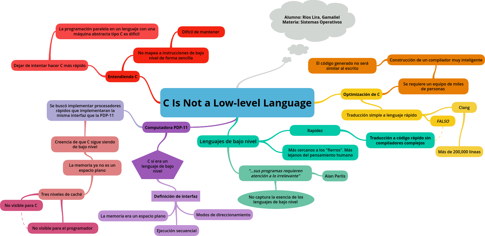

# Proyecto 1 - Reporte de Lectura
## _C Is Not a Low-Level Language_

Datos de identificación:
- **Alumno:** Ríos Lira, Gamaliel
- **Materia:** Sistemas Operativos
- **Grupo:** 6

### Trabajo desarrollado
Se desarrolló un mapa mental acerca de la lectura en cuestión, el cual se muestra a continuación [^1].

[^1]: En caso de no poder visualizarse de forma adecuada, se puede usar el siguiente 
[link](https://www.goconqr.com/es-MX/mindmap/38640595/c-is-not-a-low-level-language).
